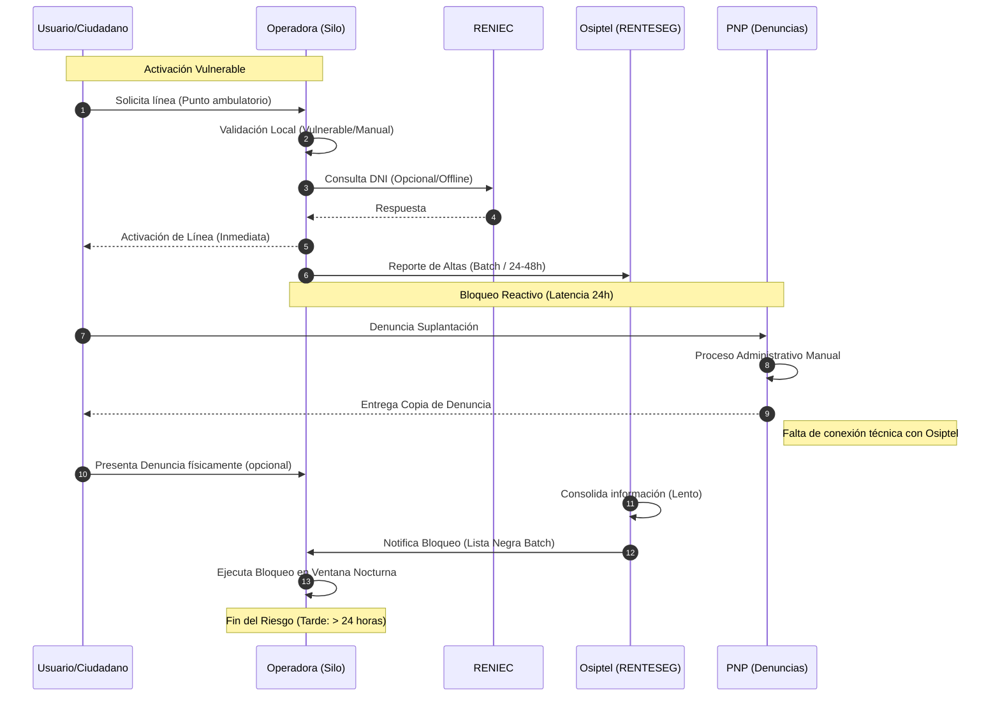
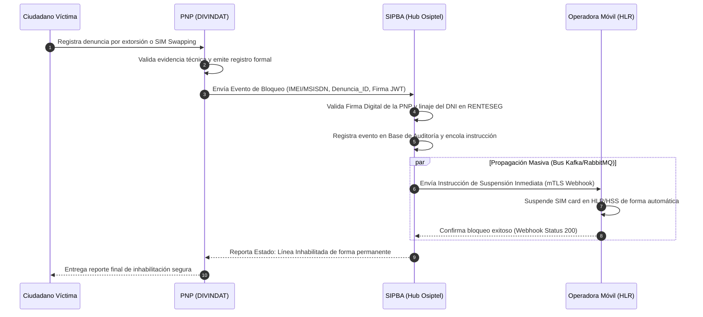
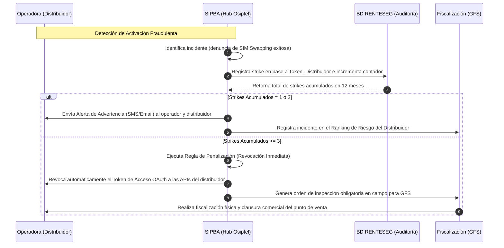

# Arquitectura de Negocio (Business Architecture)

Este documento contiene la representación de los procesos de negocio tanto en su estado actual (AS-IS) como en el objetivo (TO-BE), permitiendo un análisis de brechas claro para el sistema SIPBA.

## 1. Escenario Actual (AS-IS): Procesos Fragmentados
En el modelo actual, la falta de un Hub centralizado genera silos de información y latencias críticas de hasta 24 horas.

## 2. Escenario Objetivo (TO-BE): SIPBA Hub Transaccional

El modelo objetivo transforma a OSIPTEL en un orquestador activo mediante una **Arquitectura Orientada a Eventos (EDA)** en tiempo real. A continuación se detallan los tres procesos críticos del negocio.

---

### 2.1. Proceso de Activación Crítica con Biometría (TO-BE)

Este proceso asegura el no repudio en la venta de chips móviles, validando la identidad física del titular y aplicando reglas de control preventivas.

```mermaid
sequenceDiagram
    autonumber
    participant U as Usuario/Ciudadano
    participant O as Operadora (Distribuidor)
    participant S as SIPBA (Hub Osiptel)
    participant R as RENIEC (GTI)

    U->>O: Solicita alta de línea o reposición
    O->>O: Captura fotografía del rostro + Liveness Detection
    O->>S: Petición de Activación (DNI, Token_Distribuidor, Hash_Biométrico)
    S->>S: Verifica Reglas de Negocio (Límite 7 líneas / Blacklist Distribuidor)
    alt Regla Excedida o Distribuidor Sancionado
        S-->>O: Retorna Denegación Automática (Código de Rechazo)
        O-->>U: Muestra error de venta y bloquea transacción
    else Reglas OK
        S->>R: Transmite cotejo biométrico 1:1 (PIDE - mTLS)
        R-->>S: Score de Similitud + Validación Liveness (Éxito/Fallo)
        S->>S: Evalúa Score Mínimo y almacena Token_Verificación (Auditoría)
        alt Validación Fallida
            S-->>O: Retorna Rechazo por Inconsistencia Biométrica
            O-->>U: Notifica fallo de validación
        else Validación Exitosa
            S-->>O: Retorna Aprobación Técnica + Firma JWT
            O->>O: Habilita chip en la red móvil (HLR/HSS)
            O-->>U: Entrega de SIM card activa
        end
    end
```

#### Descripción del flujo paso a paso:
1.  **Solicitud:** El ciudadano se acerca a un punto de venta formalizado y solicita una línea móvil o reposición.
2.  **Captura Biométrica:** El terminal del distribuidor captura la biometría facial del usuario aplicando controles de prueba de vida (Liveness) locales.
3.  **Invocación al Hub:** La operadora consume el API Gateway de SIPBA enviando el DNI, coordenadas de geolocalización, código de distribuidor y el vector biométrico cifrado.
4.  **Validación de Reglas Internas:** El motor SIPBA comprueba que el distribuidor no esté sancionado y que el usuario no supere el límite nacional de 7 líneas activas a su nombre.
5.  **Cotejo Nacional:** De superarse las reglas, SIPBA consume el servicio de RENIEC vía PIDE para validar la identidad con la base de datos nacional.
6.  **Confirmación y Activación:** Si el score de coincidencia es satisfactorio, SIPBA emite una firma digital de autorización. La operadora activa físicamente el chip en la red y se registra el metadato en la base de auditoría RENTESEG.

---

### 2.2. Proceso de Denuncia e Instrucción de Bloqueo Inmediato (Interacción PNP-SIPBA)

Este proceso transforma la recepción de una denuncia por extorsión o suplantación en una acción técnica de inhabilitación de red en menos de una hora.

#### Descripción del flujo paso a paso:
1.  **Recepción de Denuncia:** El ciudadano registra su denuncia de extorsión o SIM Swapping de forma física o virtual en la PNP (DIVINDAT).
2.  **Autorización de la PNP:** Tras el análisis preliminar, la PNP firma digitalmente un payload JSON con su clave privada institucional (JWT) y remite el evento de bloqueo al API perimetral de SIPBA.
3.  **Procesamiento en Hub:** SIPBA valida el no repudio de la orden policial, cruza la información del titular de la línea en RENTESEG y cambia el estado de la línea a "Bloqueada por Orden Judicial/Policial" en la base central.
4.  **Inhabilitación Técnica:** A través de un bus de mensajes asíncronos de alta velocidad, SIPBA gatilla webhooks hacia los cores de red (HLR/HSS) de todas las operadoras involucradas.
5.  **Confirmación:** Las operadoras desasocian la tarjeta SIM de las antenas en tiempo real y devuelven una confirmación. SIPBA notifica el cierre técnico del caso a la PNP.

---

### 2.3. Proceso de Sanción Automática a Distribuidores (Regla de 3 Strikes)

Este proceso automatiza el control de la cadena de distribución comercial, inhabilitando puntos de venta sospechosos de fraude.

#### Descripción del flujo paso a paso:
1.  **Detección:** Cuando una línea de activación reciente es bloqueada exitosamente por denuncia de suplantación, el motor SIPBA rastrea la transacción original y recupera el `Token_Distribuidor` y el código de venta asociado.
2.  **Registro de Strike:** Se registra la anomalía en la base de datos de auditoría de RENTESEG y se incrementa el contador de incidentes del distribuidor específico.
3.  **Advertencia (Strikes 1 y 2):** Al acumularse los primeros strikes en un periodo móvil de 12 meses, el sistema emite notificaciones a la operadora para que tome medidas preventivas, y añade puntos de penalización al *Risk Scoring* de la GFS.
4.  **Revocación Automática (Strike 3):** Al alcanzar el tercer incidente de fraude, el motor de reglas de SIPBA de manera inmediata desautoriza las credenciales OAuth del distribuidor. Toda posterior solicitud de activación comercial desde ese punto de venta es denegada automáticamente a nivel perimetral en el API Gateway.
5.  **Fiscalización Física:** La GTIC genera una alerta prioritario-crítica en el sistema analítico de la GFS, emitiendo una orden de inspección presencial obligatoria para clausurar comercialmente el establecimiento comercial.

---

## 3. Comparativa y Gap Analysis (Brechas de Negocio)

El modelado TO-BE introduce cambios drásticos respecto a la operación actual para mitigar los desafíos de OSIPTEL:

| Característica | Estado Actual (AS-IS) | Estado Objetivo (TO-BE) | Impacto y Mitigación de Desafíos |
| :--- | :--- | :--- | :--- |
| **Tiempo de Bloqueo** | ~ 24 Horas (Batch diferido) | < 1 Hora (Tiempo real asíncrono) | **Crítico:** Reduce a minutos la ventana de tiempo para extorsiones digitales. |
| **Validación de Identidad** | Silos locales de operadoras | Centralizado en Hub SIPBA (1:1 RENIEC) | **Alto:** Evita activaciones de chips falsificados en distribuidores de dudosa procedencia. |
| **Biometría en Borde** | Opcional y vulnerable a fotos | Obligatoria con *Liveness Detection* | **Alto:** Garantiza fehacientemente la presencia física del ciudadano. |
| **Reglas de Control** | Autodeclaradas por operadoras | Controladas y aplicadas por OSIPTEL | **Autonomía:** Evita presiones políticas y comerciales. Las reglas de bloqueo son innegociables. |
| **Integración de Denuncia** | Recepción manual y en papel | API B2B con la PNP (Firmas JWT) | **Eficiencia:** Atiende flujos masivos de denuncias integrando los sistemas del Estado. |
| **Datos de Mercado** | Carga offline propensa a errores | Pipelines automáticos con metadatos de linaje | **Transparencia:** Elimina discrepancias estadísticas de conexiones de cara al inversionista. |

---

## 4. Descripción de Componentes Clave

| Componente de Negocio | Función en la Transformación de OSIPTEL |
| :--- | :--- |
| **API Gateway SIPBA** | Filtro perimetral del regulador. Asegura que las operadoras se integren bajo mTLS y OAuth 2.0. |
| **Motor de Reglas en Tiempo Real** | Aplica límites automáticos (como la regla de 7 líneas) y verifica penalizaciones de distribuidores en el borde. |
| **Módulo Analítico GFS** | Utiliza algoritmos de machine learning sencillos para calcular puntuaciones de riesgo y emitir órdenes de fiscalización inteligente en base a strikes. |
| **Pipeline de Linaje de Datos** | ETL de auditoría encargado de reconciliar diariamente las líneas reportadas con los registros transaccionales activos. |

---

## 5. Matriz de Roles y Responsabilidades (RACI de Negocio SIPBA)

Establece el involucramiento de las áreas y los actores en los flujos principales de negocio:

| Proceso | GTIC | GFS | GU / TRASU | GPRC | Operadoras | RENIEC | PNP |
| :--- | :---: | :---: | :---: | :---: | :---: | :---: | :---: |
| **Activación Biométrica** | **A** / R | C | I | I | R | S | I |
| **Bloqueo por Denuncia Real-Time** | R | **A** | C | I | R | I | S |
| **Sanción de 3 Strikes** | R | **A** | I | C | I | I | I |
| **Auditoría de Datos y Linaje** | R | R | I | **A** | C | I | I |

*Leyenda: R (Responsible - Ejecutor), A (Accountable - Aprobador final), S (Support - Apoyo), C (Consulted - Consultado), I (Informed - Informado).*

