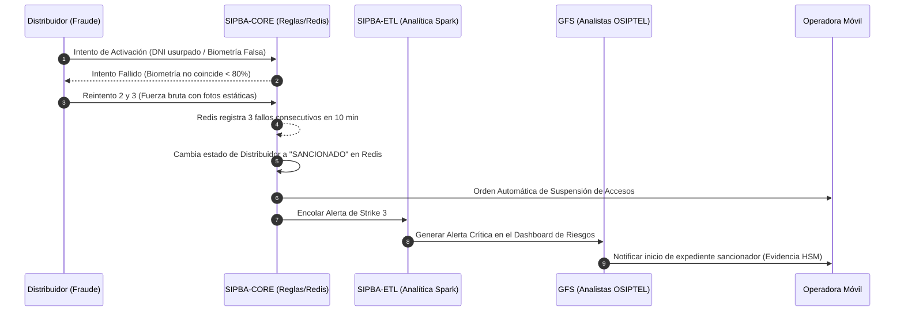

# Catálogo de Organización y Actores (Fase B: Arquitectura de Negocio)
## Proyecto OSIPTEL – Sistema de Identidad Personal y Bloqueo Automático (SIPBA)

Este documento describe la estructura organizativa de OSIPTEL y mapea los actores internos y externos involucrados en la operación, fiscalización e interacción técnica con el sistema SIPBA. Define los roles, responsabilidades y el flujo de toma de decisiones operativas.

---

## 1. Unidades Orgánicas de OSIPTEL

A continuación se detallan las gerencias de OSIPTEL que participan activamente en el ciclo de vida del negocio del SIPBA:

| Gerencia / Unidad | Rol en SIPBA | Preocupación Clave | Responsabilidad Principal |
| :--- | :--- | :--- | :--- |
| **Gerencia de Tecnologías de la Información y Comunicaciones (GTIC)** | Administrador de Plataforma | Disponibilidad del Hub (SLA < 3s) e integración segura mTLS. | Operar el API Gateway, garantizar la ciberseguridad, custodiar metadatos de auditoría y asegurar el linaje de datos. |
| **Gerencia de Supervisión y Fiscalización (GFS)** | Ente Fiscalizador y Auditor | Detección de venta ambulatoria ilegal y penalización a distribuidores. | Auditar en campo y gabinete el cumplimiento del bloqueo inmediato y el uso de biometría. Gestionar el ranking de riesgo de distribuidores. |
| **Gerencia de Usuarios (GU) y TRASU** | Gestor de Reclamos y Atención | Reducción de reclamos recurrentes por líneas no reconocidas. | Resolver quejas de suplantación de identidad, habilitar APIs de autoservicio y coordinar conciliaciones de quejas con operadoras. |
| **Gerencia de Políticas Regulatorias y Competencia (GPRC)** | Regulador Normativo | Estabilidad del mercado de telecomunicaciones y validez legal de sanciones. | Diseñar las directivas técnicas (ej. actualización de límites de líneas) y supervisar la veracidad de datos reportados al mercado. |
| **Gerencia General (GG)** | Patrocinador Ejecutivo | Cumplimiento del PEI, metas de reducción de fraude y autonomía ante la PCM. | Aprobación de excepciones de negocio críticas y supervisión de convenios institucionales (RENIEC / PNP). |

---

## 2. Inventario de Actores (Internos y Externos)

Este catálogo identifica a las personas, sistemas autónomos o entidades que actúan sobre el sistema o consumen sus servicios:

| Actor | Tipo | Rol SIPBA | Sistema que Utiliza | Descripción |
| :--- | :---: | :--- | :--- | :--- |
| **Ciudadano / Titular** | Externo | Usuario final y solicitante de línea. | Terminal de autoservicio / App Móvil | Aporta su DNI y biometría para altas. Registra denuncias de SIM Swapping. |
| **Vendedor / Distribuidor** | Externo | Ejecutor del punto de venta. | App de Ventas del Operador | Captura la biometría (Liveness) y envía la solicitud de validación. |
| **Operadora Móvil (Core)** | Externo | Proveedor de red e integrador. | Adaptador API / HLR-HSS | Ejecuta la instrucción de bloqueo de SIM y reporta las conexiones activas. |
| **Administrador de APIs (GTIC)** | Interno | Operador técnico perimetral. | Consola API Gateway / WAF | Monitorea la latencia de red, vigila cuotas y aprueba credenciales (OAuth). |
| **Analista de Datos (GTIC)** | Interno | Custodio del linaje de datos. | Pipeline Spark / Power BI | Concilia los reportes de conexiones y audita inconsistencias de mercado. |
| **Fiscalizador (GFS)** | Interno | Inspector del mercado. | Tablet de Supervisión GFS | Accede a rankings de riesgo e inspecciona puntos de venta sospechosos. |
| **DIVINDAT - PNP** | Externo | Emisor de bloqueos urgentes. | Portal de Denuncias PNP | Remite eventos de bloqueo en tiempo real tras la denuncia por extorsión. |
| **RENIEC (GTI)** | Externo | Validador de Identidad Oficial. | Web Service Biométrico PIDE | Realiza el cotejo 1:1 del rostro y retorna el score de similitud. |

---

## 3. Matriz de Roles y Responsabilidades (RACI Extendida de Procesos)

Esta matriz detalla cómo interactúan las unidades de OSIPTEL y los actores externos en los procesos críticos de negocio definidos en [01_procesos_negocio.md](file:///D:/aempre/Fase%20B/01_procesos_negocio.md):

| Proceso de Negocio SIPBA | GTIC | GFS | GU / TRASU | GPRC | Operadoras | RENIEC | PNP |
| :--- | :---: | :---: | :---: | :---: | :---: | :---: | :---: |
| **1. Validación Biométrica en Activación** | **A** | C | I | I | R | S | I |
| **2. Evaluación de Reglas (Límite 7 Líneas)** | **A** | C | I | R | R | I | I |
| **3. Bloqueo Inmediato por Denuncia** | R | **A** | C | I | R | I | **A** / R |
| **4. Sanción Automática a Distribuidores** | R | **A** | I | C | I | I | I |
| **5. Conciliación y Auditoría de Linaje** | R | R | I | **A** | C | I | I |
| **6. Resolución de Reclamos por Suplantación** | I | C | **A** | I | R | S | I |

* **A** (Accountable - Dueño/Aprobador final del proceso).
* **R** (Responsible - Ejecutor técnico u operativo).
* **S** (Support - Entidad de apoyo clave que provee datos o infraestructura).
* **C** (Consulted - Unidad consultada para reglas o auditorías).
* **I** (Informed - Unidad informada del resultado del proceso).

---

## 4. Flujo de Toma de Decisiones y Gobernanza de Negocio

El negocio de SIPBA se rige por un esquema de gobernanza ágil y blindado técnicamente ante presiones políticas:

1.  **Modificación de Reglas de Negocio:** Si la GPRC determina que el límite de 7 líneas por titular debe reducirse debido a nuevas modalidades de fraude, eleva el requerimiento al Comité de AE. La GTIC programa la nueva directiva directamente en el motor de reglas de SIPBA.
2.  **Incidentes de Datos e Inconsistencias:** Si se detectan caídas inexplicadas de líneas reportadas por operadoras (ej. WOW en 2026), el Analista de Datos de GTIC emite una alerta de linaje de datos. GFS toma control del caso e inicia auditorías de gabinete contra el operador, aplicando sanciones de comprobarse distorsión de información.
3.  **Auditoría de Contingencias de RENIEC:** Si el Web Service de RENIEC experimenta caídas prolongadas, el Administrador de GTIC activa el "Shadow Mode" del Hub. Esto encola las activaciones de forma temporal y notifica de inmediato a la GFS para fiscalización física de distribuidores, evitando parálisis comerciales pero manteniendo trazabilidad estricta.

---

## 5. Rediseño Organizacional de la GFS: De Campo a Inteligencia Analítica

La adopción de la fiscalización basada en riesgos impulsada por la **OCDE (PAFER)** exige transformar la estructura y competencias de la Gerencia de Supervisión y Fiscalización (GFS) de OSIPTEL.

### 5.1. Evolución de Perfiles y Competencias (AS-IS vs. TO-BE)

| Dimensión | Enfoque Tradicional (AS-IS) | Enfoque Basado en Riesgos (TO-BE) | Impacto en Capacidad Organizativa |
| :--- | :--- | :--- | :--- |
| **Perfil del Inspector** | Inspector generalista de campo centrado en legalidades y revisión física de puntos de venta. | **Analista Forense de Datos** y **Supervisor de Riesgo Digital**. | Transición de inspección administrativa a peritaje informático y analítico. |
| **Herramientas de Trabajo** | Actas físicas, plantillas Excel manuales y visitas aleatorias no coordinadas. | Tableros analíticos en Grafana, análisis de logs de Spark y consolas de monitoreo en tiempo real. | Digitalización al 100% de la evidencia. Reducción de costos de traslado. |
| **Criterio de Fiscalización** | Muestreo aleatorio o reactivo ante denuncias del usuario (inspecciones lentas). | **Score de Riesgo del Distribuidor** calculado por el pipeline ETL de SIPBA. | Focalización en el 5% de puntos de venta con alta probabilidad de fraude masivo. |
| **Naturaleza de la Acción** | Punitiva tardía (procesos sancionadores administrativos de 6 a 18 meses). | Preventiva inmediata y automatizada (bloqueo de accesos y alertas proactivas). | Mitigación del delito en minutos. Co-creación de cumplimiento con operadoras. |

### 5.2. Nuevas Funciones Operativas en la GFS

Para operar el SIPBA, se definen dos nuevos roles analíticos en la estructura orgánica de la GFS:

#### A. Analista Forense de Datos (Data Forensic Analyst)
*   **Misión:** Auditar la consistencia entre las altas reales de las operadoras y las aprobaciones transaccionales de SIPBA.
*   **Responsabilidades:**
    *   Supervisar la ejecución diaria del pipeline `SIPBA-ETL`.
    *   Investigar los reportes de `ALTA_SOSPECHOSA` y auditar las coordenadas GPS reportadas por las operadoras.
    *   Analizar patrones de transacciones fallidas consecutivas en el clúster Redis para identificar campañas automatizadas de fuerza bruta contra el liveness biométrico.

#### B. Supervisor de Riesgo Digital (Digital Risk Supervisor)
*   **Misión:** Orquestar y fiscalizar el comportamiento del canal de distribuidores autorizados en el mercado.
*   **Responsabilidades:**
    *   Gestionar y verificar la lista negra de distribuidores y la correcta aplicación del "Strike System".
    *   Auditar las justificaciones técnicas emitidas por las operadoras durante los pases de contingencia (RENIEC offline).
    *   Coordinar con la PNP (DIVINDAT) y el Ministerio Público el envío de evidencia digital criptográfica firmada por el HSM de OSIPTEL para procesos penales.

### 5.3. Flujo de Trabajo de Fiscalización Basada en Riesgos (Automated Alerts)

El siguiente flujo ilustra cómo el sistema SIPBA reduce drásticamente el tiempo de intervención de la GFS frente a malas prácticas del distribuidor:

### 5.4. Plan de Capacitación y Gestión del Cambio
Para habilitar a los fiscalizadores de campo actuales de OSIPTEL en los nuevos perfiles analíticos, se establece una hoja de ruta de habilitación:
1.  **Módulo 1: Fundamentos de Ciberseguridad e Identidad Digital (Meses 1-2):** Capacitación en mTLS, llaves públicas/privadas, firmas digitales de no repudio y LPDP peruana.
2.  **Módulo 2: Herramientas de Inteligencia de Datos (Meses 3-5):** Capacitación avanzada en consultas SQL, interpretación de pipelines Apache Spark, uso de orquestadores Airflow y diseño de consultas en Grafana/Kibana.
3.  **Módulo 3: Protocolos Forenses y Evidencia Digital (Meses 6-8):** Normativa legal para la custodia de logs digitales y cadena de custodia de metadatos firmados por HSM ante la fiscalía.
