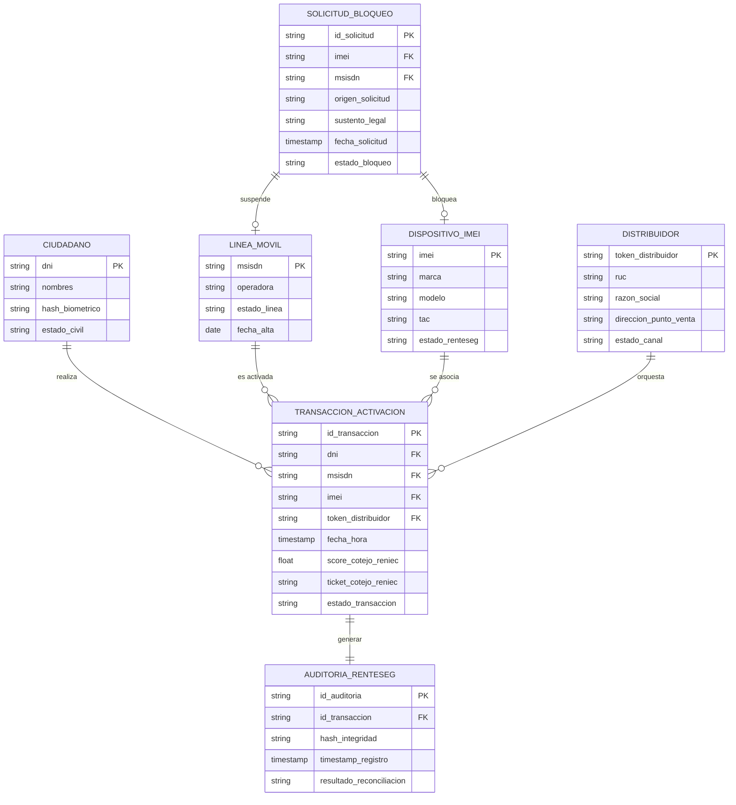

# Arquitectura de Datos (Fase C)
## Proyecto OSIPTEL – Sistema de Identidad Personal y Bloqueo Automático (SIPBA)

Este documento define la **Arquitectura de Datos (Target)** para el Proyecto SIPBA de OSIPTEL. El objetivo es estructurar, gobernar y asegurar el flujo de información necesario para la prevención del fraude por suplantación de identidad (*SIM Swapping*) y el bloqueo inmediato de equipos robados, garantizando la trazabilidad absoluta de las activaciones de líneas y la conformidad con el marco legal peruano.

---

## 1. Modelo Conceptual y Relacional de Datos

Para que SIPBA funcione como un Hub Transaccional en tiempo real, se requiere interconectar entidades de datos pertenecientes a diferentes actores (OSIPTEL, Operadoras, RENIEC y PNP). 

### 1.1. Diagrama de Entidad-Relación Lógico (Mermaid)

El siguiente diagrama ilustra las entidades core y sus relaciones lógicas:



---

## 2. Catálogo Detallado de Entidades de Datos

A continuación se detallan las especificaciones técnicas y atributos de cada una de las entidades lógicas que componen la base de datos distribuida y el almacenamiento central del SIPBA en OSIPTEL.

### 2.1. Entidad: `Ciudadano`
Contiene la información de identificación del usuario. Para mitigar riesgos de seguridad, OSIPTEL **no almacena imágenes ni minucias biométricas crudas**, solo metadatos de cotejo.

| Atributo | Tipo de Dato | Restricción | Descripción |
| :--- | :--- | :--- | :--- |
| `dni` | VARCHAR(8) | PK, Not Null | Documento Nacional de Identidad del ciudadano. |
| `nombres` | VARCHAR(150) | Not Null | Nombre completo (nombres, apellido paterno y materno). |
| `hash_biometrico` | VARCHAR(64) | Nullable | Hash unidireccional SHA-256 generado como token de sesión biométrica (temporal). |
| `estado_civil` | VARCHAR(20) | Nullable | Estado civil obtenido del padrón de RENIEC. |

### 2.2. Entidad: `Línea Móvil` (MSISDN)
Representa la línea telefónica que se asocia al chip (SIM Card).

| Atributo | Tipo de Dato | Restricción | Descripción |
| :--- | :--- | :--- | :--- |
| `msisdn` | VARCHAR(9) | PK, Not Null | Número de abonado móvil (9 dígitos en Perú). |
| `operadora` | VARCHAR(20) | Not Null | Nombre de la operadora (Claro, Movistar, Entel, Bitel, etc.). |
| `estado_linea` | VARCHAR(15) | Not Null | Estado operativo de la línea (`ACTIVA`, `SUSPENDIDA`, `DEBAJA`). |
| `fecha_alta` | DATE | Not Null | Fecha original en la que se activó la línea telefónica. |

### 2.3. Entidad: `Dispositivo` (IMEI)
Identificador único del equipo móvil que interactúa en la red. Conectado de forma lógica con el RENTESEG.

| Atributo | Tipo de Dato | Restricción | Descripción |
| :--- | :--- | :--- | :--- |
| `imei` | VARCHAR(15) | PK, Not Null | Identificador internacional de equipo móvil (15 dígitos). |
| `marca` | VARCHAR(50) | Not Null | Marca del fabricante del equipo. |
| `modelo` | VARCHAR(80) | Not Null | Modelo específico del terminal. |
| `tac` | VARCHAR(8) | Not Null | Type Allocation Code (primeros 8 dígitos del IMEI). |
| `estado_renteseg` | VARCHAR(20) | Not Null | Estado en la lista del RENTESEG (`LISTA_BLANCA`, `LISTA_NEGRA`, `LISTA_GRIS`). |

### 2.4. Entidad: `Distribuidor`
Representa al punto de venta o distribuidor autorizado que realiza la transacción comercial de activación.

| Atributo | Tipo de Dato | Restricción | Descripción |
| :--- | :--- | :--- | :--- |
| `token_distribuidor` | VARCHAR(36) | PK, Not Null | UUID único del punto de venta/distribuidor, autorizado por OSIPTEL. |
| `ruc` | VARCHAR(11) | Not Null | Registro Único de Contribuyentes del distribuidor. |
| `razon_social` | VARCHAR(150) | Not Null | Razón social de la empresa distribuidora. |
| `direccion_punto_venta` | VARCHAR(250) | Not Null | Dirección física georreferenciada del local. |
| `estado_canal` | VARCHAR(15) | Not Null | Estado del distribuidor (`AUTORIZADO`, `SANCIONADO`, `INACTIVO`). |

### 2.5. Entidad: `Transacción de Activación`
El núcleo del Hub SIPBA. Registra cada solicitud de activación en tiempo real para auditoría e imposición de reglas preventivas (ej. límite de 7 líneas).

| Atributo | Tipo de Dato | Restricción | Descripción |
| :--- | :--- | :--- | :--- |
| `id_transaccion` | VARCHAR(36) | PK, Not Null | UUID generado por el API Gateway de SIPBA. |
| `dni` | VARCHAR(8) | FK, Not Null | DNI del titular que solicita la activación. |
| `msisdn` | VARCHAR(9) | FK, Not Null | Número de teléfono que se intenta activar. |
| `imei` | VARCHAR(15) | FK, Not Null | IMEI del teléfono en el que se introduce el chip. |
| `token_distribuidor` | VARCHAR(36) | FK, Not Null | Token del distribuidor que realiza la venta. |
| `fecha_hora` | TIMESTAMP | Not Null | Marca de tiempo UTC del evento de transacción. |
| `score_cotejo_reniec` | FLOAT | Not Null | Score de similitud facial retornado por RENIEC (0.00 a 100.00). |
| `ticket_cotejo_reniec` | VARCHAR(50) | Not Null | Código de validación de transacción retornado por RENIEC. |
| `estado_transaccion` | VARCHAR(20) | Not Null | Resultado final (`APROBADA`, `DENEGADA_BIOMETRIA`, `RECHAZADA_EXCESOLINEAS`). |

### 2.6. Entidad: `Solicitud de Bloqueo`
Registra las instrucciones de bloqueo por robo, pérdida o extorsión.

| Atributo | Tipo de Dato | Restricción | Descripción |
| :--- | :--- | :--- | :--- |
| `id_solicitud` | VARCHAR(36) | PK, Not Null | UUID de la solicitud de bloqueo. |
| `imei` | VARCHAR(15) | FK, Not Null | IMEI del terminal que debe ser bloqueado. |
| `msisdn` | VARCHAR(9) | FK, Nullable | Línea móvil asociada que debe ser suspendida. |
| `origen_solicitud` | VARCHAR(20) | Not Null | Entidad emisora (`PNP_DIVINDAT`, `OPERADORA`, `AUTOSERVICIO`). |
| `sustento_legal` | VARCHAR(250) | Not Null | Número de denuncia policial o ticket de reclamo del usuario. |
| `fecha_solicitud` | TIMESTAMP | Not Null | Timestamp en el que ingresa la solicitud a SIPBA. |
| `estado_bloqueo` | VARCHAR(15) | Not Null | Estado de ejecución del bloqueo (`PENDIENTE`, `EJECUTADO`, `FALLIDO`). |

---

## 3. Cumplimiento de la Ley de Protección de Datos Personales (LPDP - Ley 29733)

Dado que SIPBA opera con datos de identidad del ciudadano, la arquitectura de datos implementa controles técnicos estrictos para alinearse con los principios de seguridad, finalidad y proporcionalidad de la LPDP peruana.

### 3.1. Principio de Proporcionalidad y No Almacenamiento Biométrico
Para evitar fugas de información crítica que comprometan la identidad digital de los peruanos (vulnerabilidad ante bases de datos biométricas centralizadas):
1. **Verificación Federada:** SIPBA actúa exclusivamente como un orquestador. Las operadoras envían la fotografía capturada del rostro en base64; SIPBA la redirige síncronamente al servicio seguro de RENIEC y recibe una respuesta binaria (Apto / No Apto) junto con un porcentaje de coincidencia (`score_cotejo_reniec`).
2. **Eliminación Inmediata de Carga Útil (Payload Scrubbing):** Las imágenes y vectores biométricos crudos de los rostros son eliminados de la memoria RAM del API Gateway de SIPBA inmediatamente después de recibir la respuesta de RENIEC. **Nunca** se escriben en discos duros, bases de datos o logs del regulador.
3. **Persistencia de Evidencia:** En la base de datos de SIPBA solo se almacena el `ticket_cotejo_reniec` y el `score_cotejo_reniec` como prueba de conformidad de la validación.

### 3.2. Encriptación de Datos
* **Datos en Tránsito:** Toda transmisión de datos entre operadoras, SIPBA, RENIEC y la PNP se realiza mediante túneles seguros con protocolo **TLS 1.3** y autenticación mutua de cliente (**mTLS**), garantizando el no repudio.
* **Datos en Reposo:** Las bases de datos relacionales y de auditoría de SIPBA están cifradas a nivel de disco físico (TDE) utilizando **AES-256**.
* **Columnas Sensibles:** El campo `hash_biometrico` y los datos del ciudadano se encriptan a nivel de columna mediante llaves gestionadas por un módulo HSM (*Hardware Security Module*) de OSIPTEL.

---

## 4. Modelo de Linaje de Datos y Reconciliación Estadística

Uno de los principales problemas de OSIPTEL es la inconsistencia de los datos estadísticos reportados por las operadoras respecto a altas y bajas. Para asegurar la veracidad de la información, se implementa un modelo de linaje que rastrea el ciclo de vida de los datos desde la transacción comercial hasta la base analítica de OSIPTEL.

### 4.1. Matriz de Linaje de Datos (Data Lineage)

Esta matriz describe la trazabilidad de los campos clave:

| Campo de Datos | Sistema de Origen | Sistema Intermedio | Sistema de Destino | Regla de Transformación |
| :--- | :--- | :--- | :--- | :--- |
| **DNI del Abonado** | CRM de la Operadora | API Gateway SIPBA | BD Transaccional SIPBA | Validación de longitud (8 caracteres) y caracteres numéricos. |
| **Score Biométrico** | API RENIEC | Motor SIPBA | BD Transaccional SIPBA | Mapeo directo a FLOAT para cálculo de umbral de aceptación (>80%). |
| **Token Distribuidor** | ERP del Distribuidor | API Gateway SIPBA | BD Transaccional SIPBA | Validación cruzada con la lista blanca de canales autorizados de OSIPTEL. |
| **Estado RENTESEG** | Base de Datos RENTESEG | Bus de Mensajería | BD Analítica OSIPTEL | Reconciliación nocturna contra lista negra y solicitudes de bloqueo de la PNP. |

### 4.2. Mecanismo de Reconciliación Diaria (Anti-manipulación)

Para evitar reportes inflados o inconsistentes de conexiones activas por parte de las operadoras móviles:

```
[Operadoras CRM]  --------(Altas/Bajas del día)-------->  [Pipeline ETL OSIPTEL]
                                                                |
                                                      (Cruce de Transacciones)
                                                                |
[BD SIPBA Transaccional]  --(Transacciones aprobadas)-->   [Motor de Conciliación] <--- (Alertas de Bloqueo) --- [PNP / RENTESEG]
                                                                |
                                                    (Generación de Reportes)
                                                                |
                                                                v
                                                     [BD Analítica Consolidada]
                                                    (Estadísticas 100% Auditadas)
```

1. **Captura Nocturna (ETL):** Un proceso automatizado en Python/Spark extrae diariamente a las 23:59:00 UTC el delta de altas y bajas reportadas en el CRM de cada operadora telefónica.
2. **Cruce de Datos (Reconciliación):** El motor de conciliación contrasta cada alta reportada por la operadora con el catálogo de `Transacciones de Activación` aprobadas por SIPBA en el mismo día. 
3. **Regla de Validación:**
   $$\text{Alta Valida} \iff (\text{Registro en CRM Operadora} \cap \text{Transacción SIPBA Aprobada} \cap \text{Score RENIEC} \ge 80\%)$$
4. **Sanciones Automáticas:** Si una operadora reporta una línea como "Activa" en su red comercial pero no existe una transacción aprobada en el Hub SIPBA para esa línea con su respectivo cotejo biométrico, la línea se marca como `ALTA_SOSPECHOSA` y se emite una orden de suspensión automática a la operadora, abriendo un expediente sancionador.
