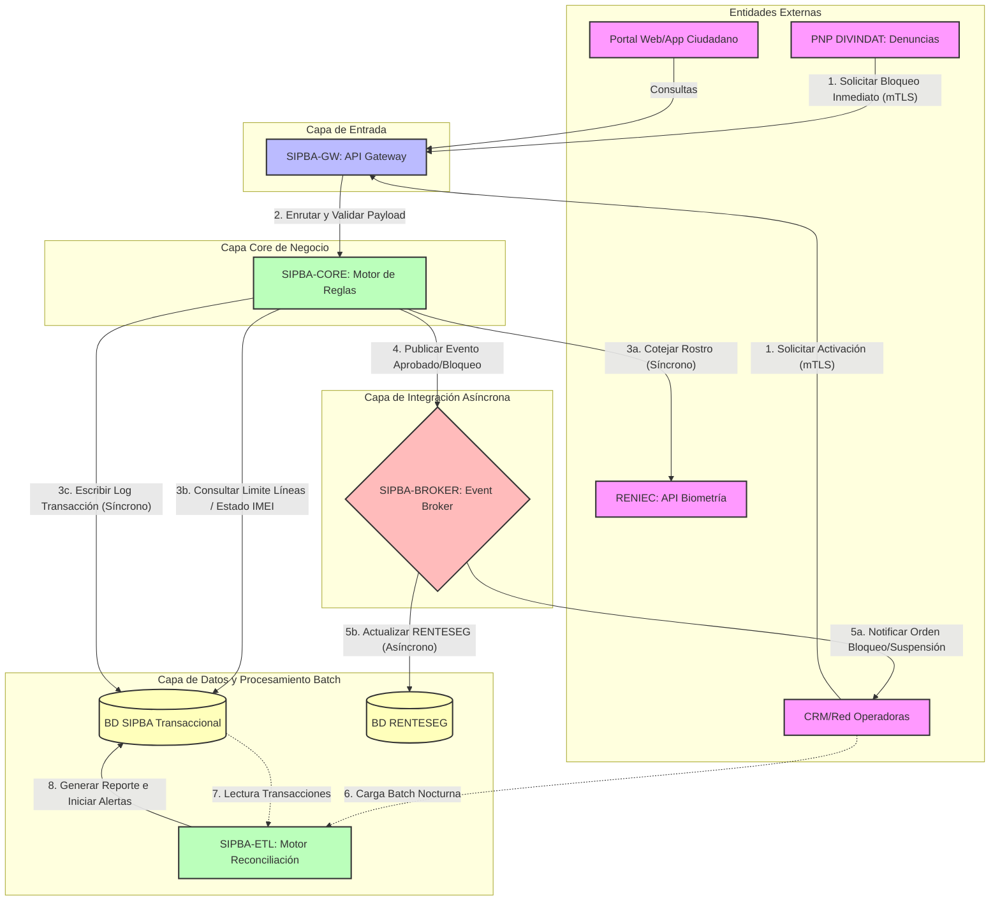

# Arquitectura de Aplicaciones (Fase C)
## Proyecto OSIPTEL – Sistema de Identidad Personal y Bloqueo Automático (SIPBA)

Este documento define la **Arquitectura de Aplicaciones (Target)** para el Proyecto SIPBA de OSIPTEL. Su propósito es estructurar los componentes de software lógicos, definir sus interacciones y establecer los patrones de integración que permitirán operar el Hub Transaccional de forma segura, escalable y con tolerancia a fallas.

---

## 1. Catálogo del Portafolio de Aplicaciones

El sistema SIPBA se compone de cuatro subsistemas lógicos clave que interactúan de forma síncrona y asíncrona para orquestar la seguridad en el ecosistema de telecomunicaciones.

```
+---------------------------------------------------------------------------------+
|                                 SIPBA SUITE                                     |
|                                                                                 |
|  +--------------------+      +--------------------+      +-------------------+  |
|  |     SIPBA-GW       | ---> |    SIPBA-CORE      | ---> |   SIPBA-BROKER    |  |
|  |   (API Gateway)    |      | (Motor de Reglas)  |      |  (Event Broker)   |  |
|  +--------------------+      +--------------------+      +-------------------+  |
|                                                                    |            |
|                                                          +-------------------+  |
|                                                          |     SIPBA-ETL     |  |
|                                                          |  (Reconciliación) |  |
|                                                          +-------------------+  |
+---------------------------------------------------------------------------------+
```

### 1.1. API Gateway Perimetral (`SIPBA-GW`)
Actúa como la única puerta de entrada y salida para todas las comunicaciones externas B2B (con Operadoras, RENIEC y PNP) y portales de usuario.

*   **Responsabilidades:**
    *   **Seguridad Perimetral (WAF):** Filtrado de peticiones maliciosas, prevención de inyecciones SQL y ataques OWASP Top 10.
    *   **Autenticación Mutua (mTLS):** Validación de certificados digitales X.509 de las operadoras y entidades externas mediante la PKI de OSIPTEL.
    *   **Autorización (OAuth 2.0):** Emisión y validación de tokens de corta duración (Client Credentials flow) para consumo de endpoints.
    *   **Control de Tráfico (Rate Limiting):** Limitación de tasa por operadora (ej. máx 200 req/seg) para mitigar denegación de servicios y scraping.
    *   **No Repudio (Firma de Payloads):** Validación de firmas JWT en los payloads de entrada y firma de las respuestas del regulador utilizando llaves criptográficas del HSM.
*   **Tecnología Recomendada:** Kong Enterprise, Apigee o AWS API Gateway.

### 1.2. Motor de Reglas Core (`SIPBA-CORE`)
El cerebro transaccional del sistema. Procesa síncronamente cada solicitud de activación y determina su aprobación o denegación ejecutando políticas regulatorias automatizadas.

*   **Responsabilidades:**
    *   **Validación de Límite de Líneas:** Consulta en tiempo real si el ciudadano excede las 7 líneas permitidas a nivel nacional.
    *   **Cotejo Biométrico (Orquestación):** Envío del vector biométrico a RENIEC y validación del score retornado (umbral mínimo de conformidad: $\ge 80\%$).
    *   **Control de Canal y Distribuidor:** Verificación de validez y estado del token del distribuidor contra la base de datos de canales autorizados.
    *   **Filtros de Lista Negra (Lista Gris/Negra RENTESEG):** Verificación de que el IMEI del terminal no esté reportado como robado o clonado.
*   **Tecnología Recomendada:** Drools (Java), OPA (Open Policy Agent) o microservicio en Go/Rust para baja latencia (< 50ms).

### 1.3. Bus de Mensajería / Event Broker (`SIPBA-BROKER`)
El habilitador del desacoplamiento de la plataforma. Recibe los eventos generados en el Core y los distribuye de forma asíncrona y confiable a los sistemas suscriptores.

*   **Responsabilidades:**
    *   **Propagación de Órdenes de Bloqueo/Suspensión:** Publicación asíncrona de solicitudes de bloqueo hacia las colas de consumo de cada operadora telefónica.
    *   **Desacoplamiento de Escritura de Auditoría:** Encolamiento de logs de transacciones hacia la base de datos distribuida y auditoría RENTESEG sin penalizar la respuesta al cliente.
    *   **Manejo de Reintentos:** Enrutamiento de mensajes fallidos a colas de reintento (Retry Queues) y colas de descarte (Dead Letter Queues - DLQ).
*   **Tecnología Recomendada:** Apache Kafka (para alto rendimiento de logs y eventos) o RabbitMQ.

### 1.4. Pipeline ETL de Reconciliación (`SIPBA-ETL`)
Proceso batch fuera de línea que se ejecuta diariamente a las 23:59:00 para garantizar la consistencia entre lo reportado por las operadoras y las transacciones validadas en SIPBA.

*   **Responsabilidades:**
    *   **Ingesta de Deltas:** Carga de los archivos planos o consumo de APIs de las operadoras conteniendo el registro de activaciones/bajas de la red celular durante el día.
    *   **Cruce y Validación:** Ejecución del proceso de conciliación (cruce del log de la operadora contra las transacciones aprobadas en `SIPBA-CORE`).
    *   **Clasificación de Anomalías:** Identificación de inconsistencias (ej. líneas dadas de alta en la operadora sin validación transaccional biométrica registrada en el regulador).
    *   **Notificación e Habilitación de Sanciones:** Generación de alertas para fiscalización y órdenes automáticas de baja.
*   **Tecnología Recomendada:** Apache Spark, Python (Pandas/Polars) con orquestación en Apache Airflow.

---

## 2. Mapa de Relaciones de Aplicación (Diagrama de Componentes)

El siguiente diagrama modela la interacción física e integraciones de las aplicaciones del SIPBA con los sistemas externos (RENIEC, PNP, Operadoras móviles y base de datos RENTESEG).



---

## 3. Flujos de Integración Críticos

### 3.1. Flujo Transaccional de Activación de Línea (Síncrono / Tiempo Real)

Este flujo se ejecuta en menos de **2 segundos** desde el punto de venta de la operadora móvil:

```
[Distribuidor]      [Operadora]        [SIPBA-GW]       [SIPBA-CORE]       [RENIEC]         [BD SIPBA]
      |                  |                 |                 |                |                 |
      |-- 1. Biometría ->|                 |                 |                |                 |
      |   & Datos Venta  |-- 2. Activar -->|                 |                |                 |
      |                  |   (JWT+mTLS)    |-- 3. Validar -->|                |                 |
      |                  |                 |   Certificado   |-- 4. Cotejar ->|                 |
      |                  |                 |                 |   Facial       |                |
      |                  |                 |                 |                |<-- 5. Score ----|
      |                  |                 |                 |                |    (e.g., 92%)  |
      |                  |                 |                 |-- 6. Validar ------------------->|
      |                  |                 |                 |   Reglas (Límite 7 Líneas)       |
      |                  |                 |                 |<-- 7. Conforme (OK) -------------|
      |                  |                 |<-- 8. Aprobado -|                                  |
      |                  |<-- 9. HTTP 200 -|                                                    |
      |<-- 10. Alta -----|   (Firma JWT)   |                                                    |
      |    Exitosa       |                 |                                                    |
```

1.  **Captura en Canal:** El distribuidor captura los datos del ciudadano, IMEI del terminal y fotografía en vivo (prueba de vida - *Liveness*).
2.  **Solicitud síncrona:** La operadora orquesta estos datos y envía una solicitud HTTPS POST cifrada al `SIPBA-GW`.
3.  **Seguridad mTLS:** `SIPBA-GW` descifra el canal seguro, valida que la firma digital del JSON pertenezca a la operadora autorizada y enruta la solicitud al `SIPBA-CORE`.
4.  **Cotejo Federado:** `SIPBA-CORE` envía de forma aislada la foto en Base64 a `RENIEC`.
5.  **Score de Identidad:** `RENIEC` responde con el ticket de validación y un score numérico.
6.  **Motor de Reglas:** `SIPBA-CORE` valida en la base de datos local que el número de DNI no posea más de 7 líneas móviles registradas, que el distribuidor no esté sancionado y que el terminal (IMEI) esté limpio.
7.  **Persistencia Transaccional:** Se registra el resultado en la `BD SIPBA` (sin almacenar fotos ni datos biométricos de rostro).
8.  **Respuesta:** `SIPBA-GW` firma criptográficamente la conformidad y responde con código HTTP 200 `APROBADA` a la operadora, la cual procede a habilitar la señal en la antena de red móvil de forma inmediata.

### 3.2. Flujo de Denuncia y Bloqueo Inmediato (Híbrido)

Orientado a suspender el servicio celular y bloquear el terminal robado en un plazo menor a **1 hora** tras la denuncia en la PNP:

```
[Denunciante]       [PNP DIVINDAT]       [SIPBA-GW]       [SIPBA-CORE]     [SIPBA-BROKER]     [Operadoras]
      |                   |                  |                 |                  |                 |
      |-- 1. Denuncia --->|                  |                 |                  |                 |
      |   (Robo/Extorsión)|-- 2. Registrar ->|                 |                  |                 |
      |                   |   Bloqueo        |-- 3. Validar -->|                  |                 |
      |                   |   (HTTP POST)    |                 |-- 4. Publicar ->|                 |
      |                   |                  |                 |   Evento         |                 |
      |                   |                  |                 |   "Bloquear"     |-- 5. Consumir ->|
      |                   |                  |                 |                  |   Evento        |
      |                   |                  |<-- 6. HTTP 202 -|                  |                 |
      |                   |<-- 7. Ticket ----|   (Aceptado)    |                  |                 |
      |                   |    Procesamiento |                 |                  |                 |
      |                   |                  |                 |                  |-- 6. Suspender -|
      |                   |                  |                 |                  |   Línea e IMEI  |
```

1.  **Denuncia Policial:** El ciudadano asiste a la PNP o registra una denuncia digital por robo/extorsión.
2.  **Llamada al API:** La PNP ingresa los datos en su terminal seguro y el sistema de la PNP gatilla automáticamente una solicitud de bloqueo inmediato al API de `SIPBA-GW` con los campos `imei`, `msisdn` (si aplica) y `sustento_legal`.
3.  **Autorización PNP:** `SIPBA-GW` valida el token JWT emitido a la PNP.
4.  **Encolamiento Asíncrono:** `SIPBA-CORE` recibe la solicitud y publica inmediatamente el evento en el topic `solicitudes-bloqueo` de `SIPBA-BROKER`.
5.  **Acuse de Recibo:** SIPBA responde de inmediato a la PNP con un HTTP 202 (Aceptado) y un ID de ticket, reduciendo el acoplamiento y liberando el hilo del cliente PNP.
6.  **Despacho y Ejecución:** Las operadoras que están suscritas al topic `solicitudes-bloqueo` consumen el mensaje de forma asíncrona en tiempo real e impactan de inmediato sus HLR/HSS (Red) y EIR (Base de datos de terminales) para bloquear la señal del chip y el IMEI del equipo en un SLA menor a 15 minutos.

---

## 4. Patrones de Integración y Desacoplamiento

Para garantizar alta disponibilidad (99.99%) y evitar que caídas de infraestructura externa afecten la operativa móvil nacional, la arquitectura implementa los siguientes patrones:

### 4.1. Patrón Event-Driven (Arquitectura Orientada a Eventos)
*   **Propagación de Cambios:** En lugar de realizar llamados HTTP punto a punto (`SIPBA` $\rightarrow$ `Operadora A`, `SIPBA` $\rightarrow$ `Operadora B`), toda orden de bloqueo o cambio de estado del RENTESEG se difunde a través de tópicos particionados del Event Broker. Esto garantiza entrega confiable (*at-least-once delivery*).
*   **Aislamiento de Operadoras:** Si los sistemas de red de una operadora móvil sufren una caída temporal, los eventos permanecen encolados en el Event Broker. Una vez restaurado el servicio, la operadora reanuda el consumo de la cola en el último offset registrado, sin pérdida de datos.

### 4.2. Tolerancia a Fallas en Cotejo Biométrico (Circuit Breaker)
El llamado síncrono al API biométrica de RENIEC es el eslabón de mayor latencia y propensión a fallas externas.
*   **Implementación de Circuit Breaker:** Si la tasa de error del API de RENIEC excede el 5% en una ventana de 1 minuto, o la latencia promedio supera los 1500 ms, el circuito se **Abre**.
*   **Comportamiento Degradado Seguro (Fallback):** Con el circuito abierto, las transacciones críticas no se bloquean de forma ciega. Se ejecuta una regla de contingencia:
    1. Se deniega la activación en canales de distribuidores no presenciales o con alta tasa de fraude.
    2. Se permite la transacción en Centros de Atención Propios del operador bajo contingencia manual (firmar declaración jurada física y registrar huella dactilar tradicional) aplicando auditoría ex-post prioritaria en el ETL nocturno.

---

## 5. Gobernanza y Seguridad de Aplicaciones

Para cumplir con la directiva nacional de Gobierno Digital (SEGDI) y las políticas internas de OSIPTEL:

*   **Firmas Digitales de No Repudio:** Cada solicitud enviada por una operadora debe incluir una firma digital en la cabecera HTTP (`X-Signature`). El API Gateway valida que el hash coincida con la llave pública registrada del operador, imposibilitando que una operadora alegue que no inició una transacción de alta o baja.
*   **Enmascaramiento Dinámico en Logs:** El componente de logging de `SIPBA-GW` y `SIPBA-CORE` cuenta con interceptores de payloads que enmascaran automáticamente datos de carácter personal como el DNI (ej. `71XXXX32`), nombres y cualquier token de sesión para cumplir con la LPDP.
*   **Gestión de Secretos:** Las credenciales de bases de datos, tokens de integración con RENIEC y llaves de firmado digital nunca se escriben en el código fuente. Se leen dinámicamente en tiempo de ejecución desde un gestor de secretos (HashiCorp Vault o Azure Key Vault).

---
*Nota: Este diseño lógico se complementará con los contratos físicos JSON y payloads estructurados detallados en el siguiente entregable ([03_integracion_sistemas.md](file:///D:/aempre/Fase%20C/03_integracion_sistemas.md)).*
