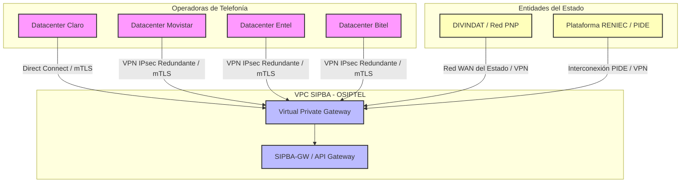

# Diseño de Infraestructura y Redes (Fase D)
## Proyecto OSIPTEL – Sistema de Identidad Personal y Bloqueo Automático (SIPBA)

Este documento define el **Diseño de Infraestructura y Redes** (Target) para el Proyecto SIPBA de OSIPTEL. Establece el modelo de nube híbrida, la segmentación de redes (VPC), los canales físicos de interconexión con operadoras y entidades externas, y el diseño de cómputo basado en microservicios orquestados en Kubernetes.

---

## 1. Modelo de Despliegue: Nube Híbrida Gubernamental

El SIPBA procesa transacciones críticas en tiempo real que requieren alta escalabilidad elástica y al mismo tiempo almacenamiento seguro y soberanía nacional de datos. Se adopta un modelo de **Nube Híbrida**:

1.  **Zona de Nube Pública Segura (AWS/Azure - Región de Baja Latencia):**
    *   Soporta la capa transaccional de alta concurrencia: el API Gateway (`SIPBA-GW`) y el Motor de Reglas (`SIPBA-CORE`).
    *   Proporciona autoescalado rápido ante picos de activaciones comerciales (ej. campañas navideñas o Cyber Days).
2.  **Zona On-Premises (Centro de Datos OSIPTEL / Data Center de Gobierno):**
    *   Aloja los sistemas de auditoría histórica, el HSM (Hardware Security Module) físico del regulador para la firma digital de no repudio, y las integraciones heredadas.
    *   Conectada a la Nube Pública mediante enlaces dedicados redundantes (VPN IPsec / AWS Direct Connect).

---

## 2. Topología de Red (VPC)

El entorno en la nube se estructura bajo una **VPC (Virtual Private Cloud)** dedicada, segmentada en subredes aisladas distribuidas en tres zonas de disponibilidad (AZ) para asegurar tolerancia a fallas a nivel de Data Center físico:

```
[Internet / Tráfico Operadoras, PNP y RENIEC]
                    |
                    v
       [AWS Shield / DDoS Protection]
                    |
                    v
    +-----------------------------------------------------------------------+
    | VPC OSIPTEL - SIPBA (Región: us-east-1)                                |
    |                                                                       |
    |  +-----------------------------------------------------------------+  |
    |  | SUBREDES PÚBLICAS (DMZ) - Multi-AZ                              |  |
    |  |                                                                 |  |
    |  |  [WAF] --> [Application Load Balancer (ALB) - HTTPS / mTLS]     |  |
    |  +-----------------+-----------------------------------------------+  |
    |                    |                                                  |
    |                    v                                                  |
    |  +-----------------------------------------------------------------+  |
    |  | SUBREDES PRIVADAS (Capa de Aplicaciones) - Multi-AZ             |  |
    |  |                                                                 |  |
    |  |  Clúster EKS (Nodos de Trabajo):                                |  |
    |  |  - Pods: SIPBA-GW (Ingress Kong)                                |  |
    |  |  - Pods: SIPBA-CORE (Rules Engine Go/Java)                      |  |
    |  +-----------------+-----------------------------------------------+  |
    |                    |                                                  |
    |                    v                                                  |
    |  +-----------------------------------------------------------------+  |
    |  | SUBREDES ULTRA-PRIVADAS (Capa de Datos) - Multi-AZ              |  |
    |  |                                                                 |  |
    |  |  - BD PostgreSQL Aurora (Primary & Read Replicas)               |  |
    |  |  - Redis Cluster Cache                                          |  |
    |  |  - Apache Kafka Nodes                                           |  |
    |  +-----------------------------------------------------------------+  |
    +-----------------------------------------------------------------------+
```

### 2.1. Segmentación de Subredes

*   **Subred Pública (DMZ):**
    *   No contiene servidores de aplicaciones ni de datos.
    *   Aloja los balanceadores de carga de aplicación (**ALB/NLB**) y el firewall web (**WAF**).
    *   Es el único punto expuesto al tráfico externo, procesando exclusivamente peticiones por los puertos HTTPS (443).
*   **Subred Privada (Aplicaciones):**
    *   Contiene los nodos de cómputo del clúster de Kubernetes.
    *   No tiene direccionamiento IP público ni acceso de entrada directo desde internet.
    *   La comunicación saliente (para consumir el API de RENIEC) se canaliza exclusivamente mediante pasarelas de traducción de red (**NAT Gateways**).
*   **Subred Aislada (Datos):**
    *   Subred sin acceso directo a internet de entrada ni de salida.
    *   Aloja las bases de datos de transacciones, los nodos del event broker (Kafka) y la caché en memoria (Redis).
    *   El acceso a estas IPs está restringido mediante grupos de seguridad de red únicamente para los rangos CIDR de la capa de aplicaciones.

---

## 3. Canales de Interconexión y Conectividad B2B

Para garantizar la seguridad del tráfico transaccional de telecomunicaciones entre OSIPTEL y los diferentes actores, se implementan enlaces de comunicación privada y segura:



### 3.1. Enlaces con las Operadoras (Claro, Movistar, Entel, Bitel)
*   **Canal Principal (Claro / Movistar):** Enlace físico dedicado **AWS Direct Connect** o **Azure ExpressRoute** de 1 Gbps, provisto por operadores de telecomunicaciones de primer nivel en el Perú. Esto asegura latencia predecible (< 15ms) y elimina la variabilidad del internet público.
*   **Canal de Respaldo (Todas):** Túneles **VPN IPsec Sitio-a-Sitio** redundantes sobre internet pública con cifrado AES-256-GCM e intercambio de llaves IKEv2.
*   **Capa de Autenticación:** Independientemente de la ruta (Direct Connect o VPN), se exige autenticación **mTLS** a nivel de transporte con certificados cliente generados y firmados por la PKI de OSIPTEL.

### 3.2. Conectividad con RENIEC y PNP
*   **RENIEC:** Se establece un canal seguro mediante la **Plataforma de Interoperabilidad del Estado Peruano (PIDE)** coordinada por la SEGDI, utilizando túneles VPN IPsec dedicados y seguros entre el data center de RENIEC y la VPC de SIPBA.
*   **PNP (DIVINDAT):** Enlace seguro mediante la red WAN institucional de la Policía Nacional del Perú, accediendo a un endpoint securizado con tokens específicos asignados a la Dirección de Investigación de Delitos de Alta Tecnología.

---

## 4. Arquitectura de Cómputo y Orquestación (Kubernetes)

El motor transaccional de SIPBA se despliega sobre un clúster gestionado de **Kubernetes (AWS EKS)** que automatiza la disponibilidad, escalado e implementación de parches.

### 4.1. Configuración del Clúster
*   **Nodos de Control (Control Plane):** Gestionados en alta disponibilidad por el proveedor de nube a través de tres zonas de disponibilidad.
*   **Nodos de Trabajo (Worker Nodes):** Desplegados en **Auto Scaling Groups (ASG)** basados en instancias optimizadas para computación (ej. familias `c6i.xlarge` de AWS) con sistemas operativos hardening (Bottlerocket o Red Hat Enterprise Linux CoreOS).

### 4.2. Autoescalado Automático (Scaling Policies)
Para manejar la fluctuación del tráfico (ej. alta tasa de compras de chips de 10:00 a 20:00 y caída drástica en la madrugada):
*   **Horizontal Pod Autoscaler (HPA):** Incrementa el número de réplicas de los microservicios de `SIPBA-GW` y `SIPBA-CORE` basándose en el consumo de CPU y memoria (umbral de escalado: 70%).
*   **Karpenter / Cluster Autoscaler:** Añade o remueve de forma dinámica servidores físicos (nodos EC2) al clúster de Kubernetes en menos de 60 segundos si los pods pendientes no caben en la infraestructura actual.

### 4.3. Políticas de Red de Kubernetes (Network Policies)
A nivel de software, los pods no tienen libre comunicación. Se aplica el **Principio de Mínimo Privilegio** usando plugins de red (CNI) como Calico:
*   Los pods del Ingress Controller (`SIPBA-GW`) solo pueden enviar tráfico a los pods del motor de reglas (`SIPBA-CORE`). No tienen permiso para comunicarse directamente con las bases de datos.
*   Los pods de `SIPBA-CORE` solo pueden comunicarse con el Ingress Controller, con las APIs externas (RENIEC) y con la subred aislada de bases de datos/Kafka.
*   Cualquier otro tráfico este-oeste entre espacios de nombres (namespaces) dentro del clúster está bloqueado de manera predeterminada (*Default Deny*).

---
*Nota: La configuración del clúster y el diseño de redes aquí descritos dan soporte al middleware y bases de datos detallados en el entregable de plataformas de datos ([02_plataformas_datos.md](file:///D:/aempre/Fase%20D/02_plataformas_datos.md)).*
