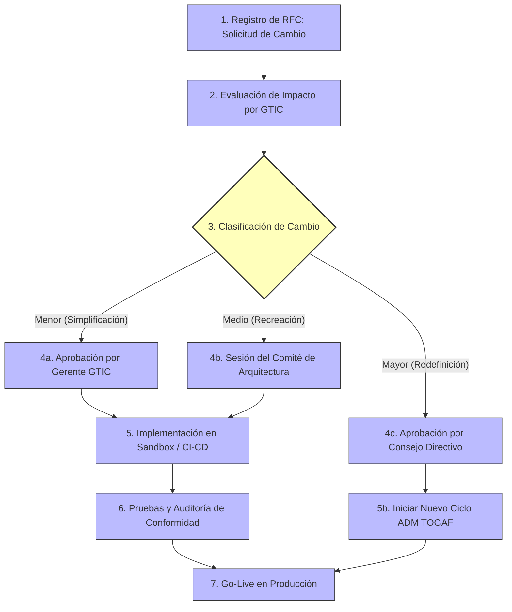

# Proceso de Gestión de Cambios de la Arquitectura (Fase H)
## Proyecto OSIPTEL – Sistema de Identidad Personal y Bloqueo Automático (SIPBA)

Este entregable establece el **Procedimiento Formal para la Gestión de Cambios** (Architecture Change Management) del ecosistema SIPBA. Define el ciclo de vida de las Solicitudes de Cambio de Arquitectura (RFC) y proporciona una taxonomía clara para evaluar, priorizar y autorizar modificaciones de diseño sin comprometer la estabilidad nacional de la plataforma.

---

## 1. Clasificación de Cambios de Arquitectura

Siguiendo las directrices de la metodología TOGAF, los cambios solicitados sobre la arquitectura del SIPBA se clasifican en tres categorías operativas:

### 1.1. Simplificación (Cambio Menor)
*   **Definición:** Modificaciones sobre componentes físicos de infraestructura o software que no alteran el diseño lógico, los flujos transaccionales ni las reglas de negocio.
*   **Ejemplos:** Ajustes en los tamaños de instancias EKS, optimización de índices SQL, cambios de tiempos de retención en Kafka o actualizaciones de versión menores (parches de seguridad).
*   **Autoridad de Aprobación:** Gerencia de GTIC (OSIPTEL). No requiere sesionar el Comité de Arquitectura interinstitucional.

### 1.2. Recreación (Cambio Medio)
*   **Definición:** Modificaciones que alteran las interfaces de aplicaciones, agregan nuevos endpoints de integración o cambian flujos secundarios, pero manteniendo intactos los principios estratégicos y bases de datos nucleares.
*   **Ejemplos:** Agregar una nueva API de consultas secundarias para la Fiscalía, modificar el formato JSON de Webhooks con las operadoras, o cambiar la base analítica ex-post de Spark.
*   **Autoridad de Aprobación:** Comité de Arquitectura Core (GTIC + GFS + GU). Requiere sesión mensual y actualización del Contrato de Arquitectura (Fase G).

### 1.3. Redefinición (Cambio Mayor)
*   **Definición:** Transformaciones estructurales que modifican las reglas regulatorias fundamentales de negocio, cambian los principios de diseño de ciberseguridad o reemplazan componentes nucleares de la arquitectura empresarial.
*   **Ejemplos:** Cambiar el límite legal de 7 líneas por DNI a un número dinámico, integrar biometría de iris en canales de venta, o reemplazar el modelo de verificación biométrica centralizada de RENIEC por una red de Identidad Digital Soberana (SSI).
*   **Autoridad de Aprobación:** Consejo Directivo (Presidencia) de OSIPTEL. **Dispara automáticamente el inicio de un nuevo ciclo ADM de TOGAF** (retorno a Fase Preliminar / Fase A).

---

## 2. Ciclo de Vida de la Solicitud de Cambio (RFC)

Toda modificación de diseño sobre el sistema SIPBA debe canalizarse formalmente mediante el siguiente flujo operativo:

### 2.1. Descripción de Etapas del Proceso

1.  **Registro de RFC (Request for Change):** El solicitante (cualquier operadora móvil, la PNP, RENIEC o una gerencia interna de OSIPTEL) registra un formulario formal detallando la justificación del cambio, impacto operacional esperado y planos técnicos preliminares.
2.  **Evaluación de Impacto:** La GTIC realiza un análisis técnico de viabilidad, evaluando latencias estimadas (para no violar el SLA de 50ms), impacto en la privacidad (LPDP) y costos en infraestructura.
3.  **Clasificación y Aprobación:** Se deriva el cambio al nivel jerárquico correspondiente según la clasificación de la sección 1.
4.  **Implementación y Auditoría:** Una vez aprobado, el cambio se programa y despliega en entornos de Sandbox. Los auditores de OSIPTEL aplican la [Guía de Revisiones de Conformidad](file:///D:/aempre/Fase%20G/02_revisiones_conformidad.md) antes de firmar el pase a producción.

---
*Nota: Los desafíos y directrices para guiar al comité ante evoluciones tecnológicas complejas (como deepfakes o redes 6G) se detallan en el Plan de Evolución Tecnológica ([02_evolucion_tecnologica.md](file:///D:/aempre/Fase%20H/02_evolucion_tecnologica.md)).*
