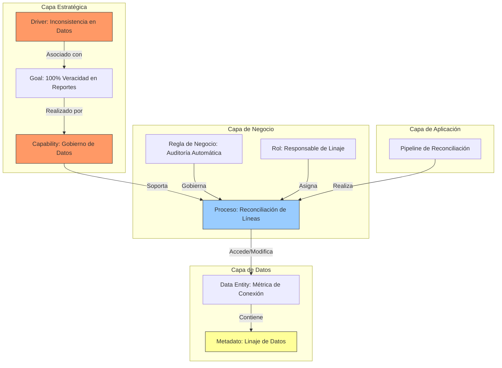

# Metamodelo de Arquitectura (Architecture Metamodel)

Establece el lenguaje común, los conceptos y las relaciones estructurales entre los dominios estratégicos, de negocio, datos, aplicación y tecnología del ecosistema institucional de OSIPTEL.

---

## 1. Entidades Clave por Capa (Metamodelo Ampliado)

Para evitar un enfoque reduccionista centrado solo en el software, se ha integrado la **Capa de Motivación y Estrategia** al metamodelo, permitiendo justificar cada elemento técnico en base a un desafío real del regulador.

### Capa de Motivación y Estrategia
*   **Driver (Impulsor):** Factores de cambio internos o externos como *Inestabilidad Política*, *Alta Carga de Reclamos (1.25M+)*, o *Pérdida de Credibilidad en Datos Sectoriales*.
*   **Goal (Meta/Objetivo):** Resultados deseados como *Blindar la Continuidad del Servicio*, *Reducir Tiempos de Bloqueo*, o *Garantizar 100% de Veracidad de Conexiones*.
*   **Capability (Capacidad de Negocio):** Habilidades organizacionales de OSIPTEL, tales como *Fiscalización Basada en Riesgos*, *Gobierno de Datos Regulatorios*, o *Gestión Inteligente de Quejas*.

### Capa de Negocio
*   **Proceso de Negocio:** Flujos como el *Proceso de Detección Biométrica en Venta*, *Proceso de Fiscalización de Puntos de Venta*, o *Proceso de Reconciliación de Líneas de Operadores*.
*   **Regla de Negocio:** Directivas que guían los procesos, tales como *Límite de 7 líneas por titular*, o *Pérdida de código de venta ante 3 incidencias*.
*   **Actor Interno/Externo:** Operadoras, RENIEC, PNP, Ciudadano, Fiscalizador GFS, y Analista de Datos GTIC.
*   **Rol de Negocio:** Perfiles que ejecutan actividades, como *Responsable de Linaje de Datos* o *Auditor de Calidad*.

### Capa de Datos
*   **Activo RENTESEG:** Registro de terminales y líneas vinculadas (`IMEI`, `DNI`, `Clave_Temporal`).
*   **Entidad de Verificación Biométrica:** Metadatos de la validación exitosa (`Token_de_Verificacion`, `Score_de_Similitud`, `Timestamp`).
*   **Métrica de Conexión Sectorial:** Datos de infraestructura de operadoras reportados al mercado (líneas activas, conexiones fijas).
*   **Metadato de Linaje de Datos:** Información técnica que traza el origen, transformaciones y destino de los datos de conexiones para garantizar consistencia y auditoría rápida.

### Capa de Aplicación
*   **Servicio de Fachada (API Gateway):** Punto de entrada perimetral para validación de esquemas, mTLS y rate limiting.
*   **Servicio Core (Motor SIPBA):** Orquestador de reglas, evaluación de perfiles de riesgo y emisión de alertas.
*   **Pipeline de Reconciliación (ETL):** Aplicación encargada de extraer, validar y consolidar las conexiones reportadas por operadores contra RENTESEG y bases comerciales.

### Capa de Tecnología
*   **Servicio de Infraestructura:** Servidor de colas (RabbitMQ/Kafka) para encolar eventos de bloqueo.
*   **Evento de Bloqueo:** Instrucción ejecutada mediante Webhook seguro hacia el core de la operadora móvil.

---

## 2. Relaciones Estructurales

El metamodelo vincula de extremo a extremo la estrategia de OSIPTEL con la tecnología física:

1.  **Alineación Estratégica:** Un *Driver* de dificultad institucional se asocia a un *Goal*, el cual se materializa en una *Capability*.
2.  **Soporte de Procesos:** La *Capability* estratégica soporta la ejecución de un *Proceso de Negocio*.
3.  **Realización Técnica:** Un *Componente de Aplicación* (como el *Pipeline de Reconciliación* o el *API Gateway*) realiza la automatización del *Proceso de Negocio*.
4.  **Uso de Datos:** El *Proceso de Negocio* accesses o modifica la *Métrica de Conexión*, la cual contiene *Metadatos de Linaje de Datos* para asegurar la trazabilidad requerida por la transparencia institucional.

---

## 3. Gobernanza e Intercambio de Datos Críticos

Para garantizar el cumplimiento de la Ley de Protección de Datos Personales (LPDP) y la consistencia de la información:

*   **Minimización de Datos Biométricos:** OSIPTEL no almacena vectores biométricos crudos de ciudadanos. Solo intercambia un `Token_de_Verificacion` emitido por RENIEC, el `DNI_Titular`, y el `Score_de_Similitud_Biometrica`.
*   **Trazabilidad de Líneas Activas:** Cada reporte de líneas activas enviado por las operadoras debe incluir una firma digital y un hash criptográfico en el metadato de origen. Esto permite a OSIPTEL auditar de manera inmediata cualquier cambio o inconsistencia (como la variación de líneas en operadores específicos) sin generar desconfianza en el mercado.
