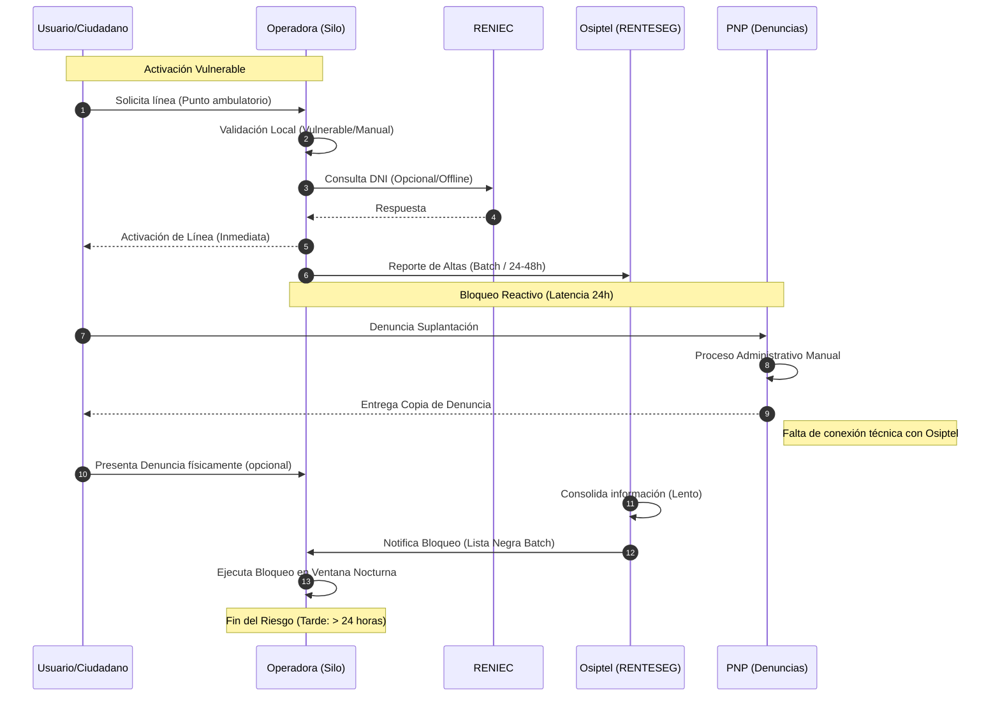
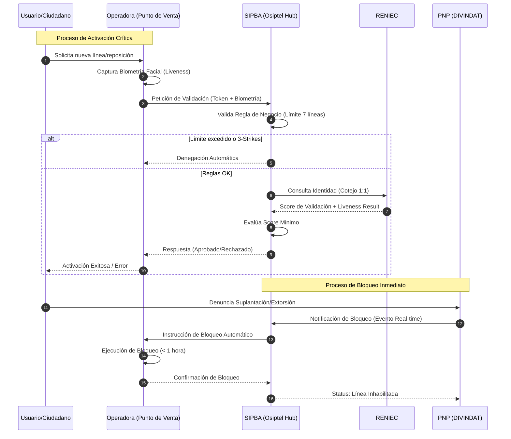

# Arquitectura de Negocio (Business Architecture)

Este documento contiene la representación de los procesos de negocio tanto en su estado actual (AS-IS) como en el objetivo (TO-BE), permitiendo un análisis de brechas claro para el sistema SIPBA.

## 1. Escenario Actual (AS-IS): Procesos Fragmentados
En el modelo actual, la falta de un Hub centralizado genera silos de información y latencias críticas de hasta 24 horas.

## 2. Escenario Objetivo (TO-BE): SIPBA Hub Transaccional
El nuevo modelo transforma a Osiptel en un orquestador activo que elimina la latencia y centraliza la seguridad.

## 3. Comparativa y Gap Analysis (Brechas)

| Característica | Estado Actual (AS-IS) | Estado Objetivo (TO-BE) | Impacto |
| :--- | :--- | :--- | :--- |
| **Tiempo de Bloqueo** | ~ 24 Horas (Batch) | < 1 Hora (Real-time) | **Crítico:** Reduce ventana de extorsión. |
| **Validación Identidad** | Local / Silos | Centralizada en Hub (RENIEC) | **Alto:** Elimina suplantación en puntos de venta. |
| **Biometría** | Opcional / Sin prueba vida | Obligatoria + Liveness | **Alto:** Garantiza presencia física del titular. |
| **Rol de Osiptel** | Pasivo (Registro posterior) | Activo (Garante/Orquestador) | **Estratégico:** Control total del ecosistema. |
| **Integración PNP** | Manual / Papel | API / Eventos Digitales | **Operativo:** Eficiencia en respuesta al crimen. |

## 4. Descripción de Componentes Clave
... (Resto del documento previo)

| Componente | Función en el Negocio |
| :--- | :--- |
| **SIPBA Hub** | Orquestador de reglas de negocio y puente de confianza entre el Estado y el sector privado. |
| **Regla de Límite** | Control preventivo para evitar el acopio de líneas por parte de organizaciones criminales. |
| **Validación Biométrica** | Asegura el no repudio y la identidad real del solicitante mediante cotejo con la base nacional. |
| **Integración PNP** | Transforma la denuncia reactiva en una acción técnica proactiva e inmediata. |

## 3. Matriz de Roles y Responsabilidades (RACI Simplificada)

| Proceso | Osiptel | Operadoras | RENIEC | PNP |
| :--- | :---: | :---: | :---: | :---: |
| Activación con Biometría | A / R | C | S | I |
| Bloqueo por Denuncia | A / R | C | I | S |
| Sanción a Distribuidores | A / R | I | I | I |

*Leyenda: R (Responsible), A (Accountable), S (Support), C (Consulted), I (Informed)*
