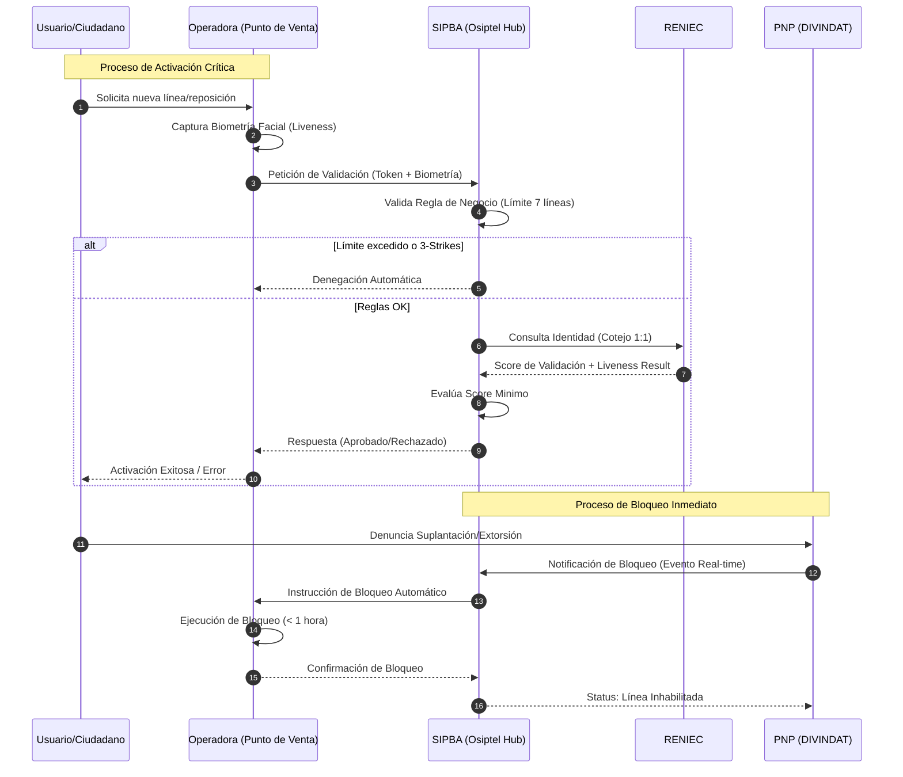

# Arquitectura de Negocio (Business Architecture)

Este documento contiene la representación de los procesos de negocio objetivo (TO-BE) para el sistema SIPBA, enfocándose en la interacción entre los actores clave para mitigar el fraude de identidad.

## 1. Diagrama de Procesos TO-BE (SIPBA Hub Transaccional)

El siguiente diagrama ilustra el flujo de negocio central, donde Osiptel actúa como un Hub que orquesta la validación de identidad y el bloqueo inmediato de líneas.

## 2. Descripción de Componentes del Diagrama

| Componente | Función en el Negocio |
| :--- | :--- |
| **SIPBA Hub** | Orquestador de reglas de negocio y puente de confianza entre el Estado y el sector privado. |
| **Regla de Límite** | Control preventivo para evitar el acopio de líneas por parte de organizaciones criminales. |
| **Validación Biométrica** | Asegura el no repudio y la identidad real del solicitante mediante cotejo con la base nacional. |
| **Integración PNP** | Transforma la denuncia reactiva en una acción técnica proactiva e inmediata. |

## 3. Matriz de Roles y Responsabilidades (RACI Simplificada)

| Proceso | Osiptel | Operadoras | RENIEC | PNP |
| :--- | :---: | :---: | :---: | :---: |
| Activación con Biometría | A / R | C | S | I |
| Bloqueo por Denuncia | A / R | C | I | S |
| Sanción a Distribuidores | A / R | I | I | I |

*Leyenda: R (Responsible), A (Accountable), S (Support), C (Consulted), I (Informed)*
